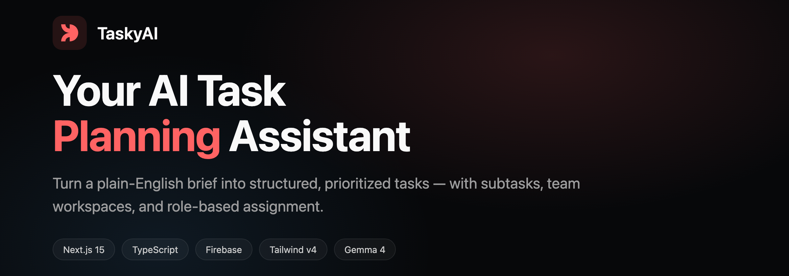
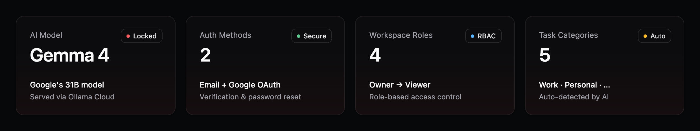
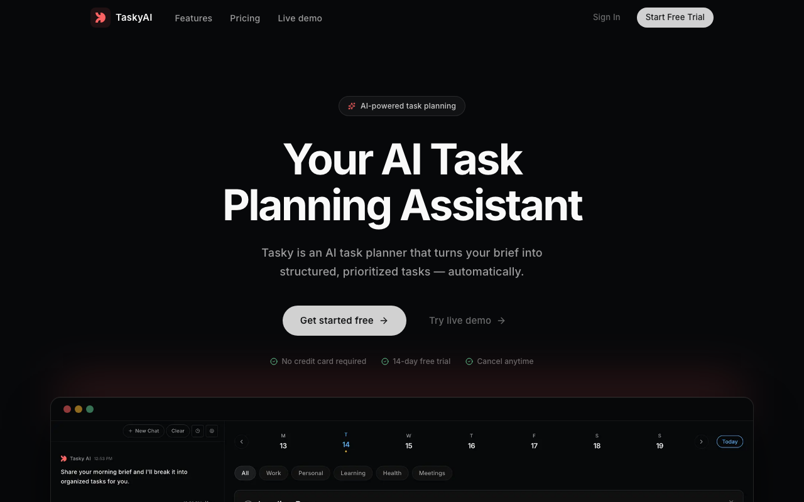
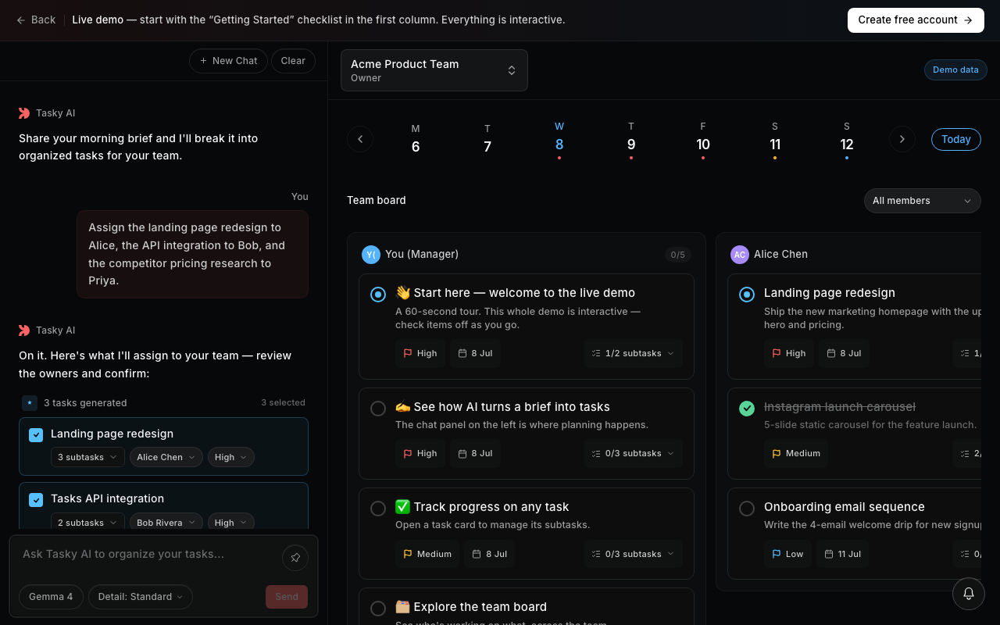
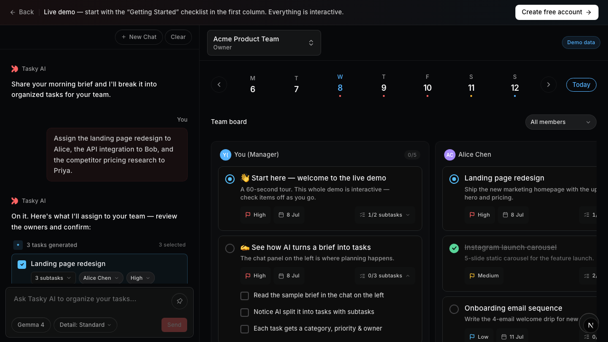
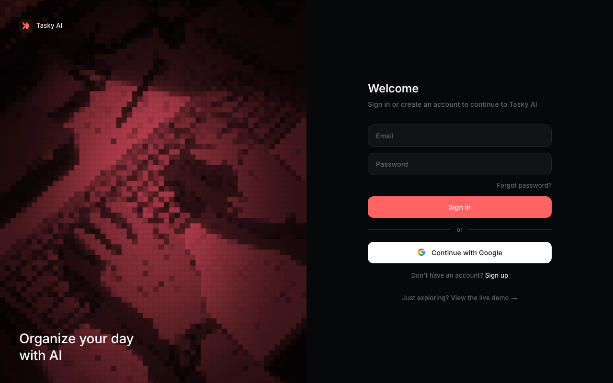

<div align="center">



# TaskyAI — AI Task Planner

Turn a plain-English brief into structured, prioritized tasks — with subtasks, categories, team workspaces, and role-based assignment. A full-stack Next.js app with Firebase auth, real-time Firestore, RBAC team workspaces, and an AI planning assistant.

<br>

[](https://task-planner-seven-zeta.vercel.app)
&nbsp;
[](https://task-planner-seven-zeta.vercel.app/demo)

<br>


</div>

---

## 📊 At a glance



---

## ✨ Highlights

- **AI task planning** — describe your day in the chat; the assistant returns tasks with descriptions, categories, priorities, due dates, and subtasks.
- **Team workspaces + RBAC** — owner / admin / member / viewer roles, member invites, and manager-only AI task assignment across a team.
- **Manager team board** — a Kanban view grouped by assignee, filterable by member, category, and date.
- **Full auth** — email/password and Google OAuth, signup, email verification, password reset, and httpOnly session cookies.
- **Unified settings** — editable profile, workspaces, plan, model, Google Calendar connect, and sign out on one page.
- **Guided live demo** — a public `/demo` route that teaches the product through interactive demo tasks.

---

## 📸 Screenshots

<table>
  <tr>
    <td width="50%"><br><sub><b>Landing</b> — marketing home with live-demo CTA</sub></td>
    <td width="50%"><br><sub><b>Guided demo</b> — a getting-started checklist beside a real team board</sub></td>
  </tr>
  <tr>
    <td width="50%"><br><sub><b>Interactive tasks</b> — expandable, checkable subtasks with live progress</sub></td>
    <td width="50%"><br><sub><b>Auth</b> — email/password + Google, verification & reset</sub></td>
  </tr>
</table>

---

## 🧱 Tech stack

| Layer | Tech |
| --- | --- |
| Framework | Next.js 15 (App Router), React 19, TypeScript |
| Styling | Tailwind CSS v4, Framer Motion |
| Auth & data | Firebase Authentication, Cloud Firestore, Firebase Admin SDK |
| AI | Gemma 4 via Ollama Cloud (provider abstraction in `lib/llm-providers.ts`) |
| Hosting | Vercel |

---

## 🚀 Getting started

```bash
npm install
npm run dev        # http://localhost:3000
```

Create a `.env.local` with your Firebase and model credentials:

```bash
# Firebase (client)
NEXT_PUBLIC_FIREBASE_API_KEY=
NEXT_PUBLIC_FIREBASE_AUTH_DOMAIN=
NEXT_PUBLIC_FIREBASE_PROJECT_ID=
NEXT_PUBLIC_FIREBASE_STORAGE_BUCKET=
NEXT_PUBLIC_FIREBASE_MESSAGING_SENDER_ID=
NEXT_PUBLIC_FIREBASE_APP_ID=

# Firebase (admin)
FIREBASE_PROJECT_ID=
FIREBASE_CLIENT_EMAIL=
FIREBASE_PRIVATE_KEY=

# AI model (Gemma 4 via Ollama Cloud)
OLLAMA_API_KEY=
OLLAMA_BASE_URL=https://ollama.com
```

### Scripts

```bash
npm run dev        # start dev server
npm run build      # production build
npm run start      # serve the production build
```

---

## 🗂️ Project structure

```
app/            Next.js App Router pages + API routes
  api/chat/     AI planning endpoint
  demo/         public guided demo
  settings/     account & preferences
components/     UI (chat, task board, auth, landing)
lib/            auth, LLM providers, RBAC, workspace, demo data
hooks/          client hooks (user profile, admin auth)
types/          shared TypeScript types
```

<div align="center"><sub>Built with Next.js, Firebase, and Gemma 4 · <a href="https://task-planner-seven-zeta.vercel.app">Live app</a> · <a href="https://task-planner-seven-zeta.vercel.app/demo">Try the demo</a></sub></div>
